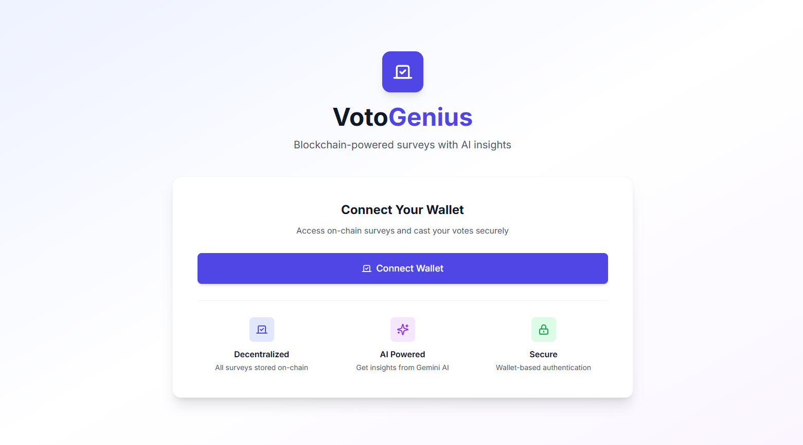
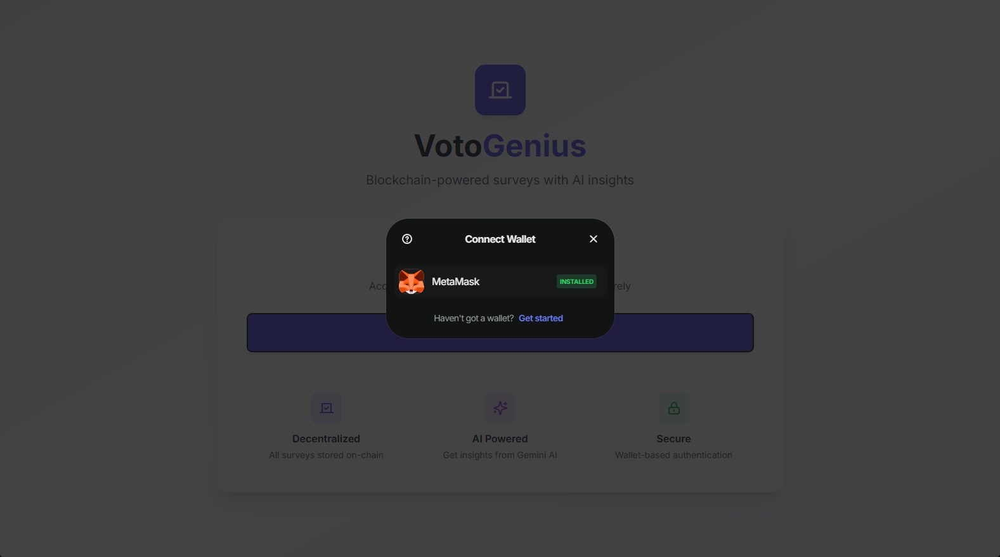
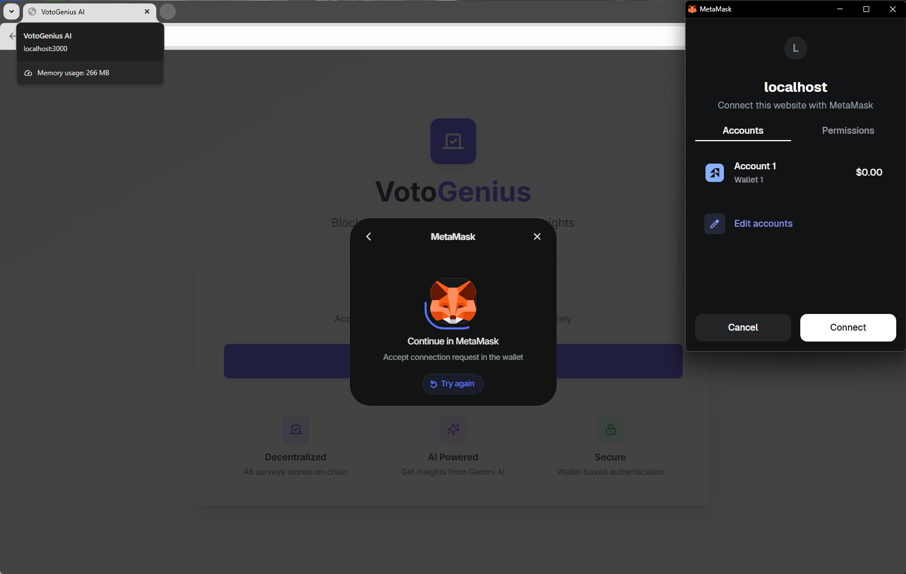
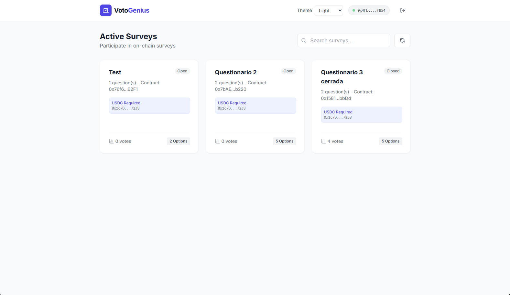
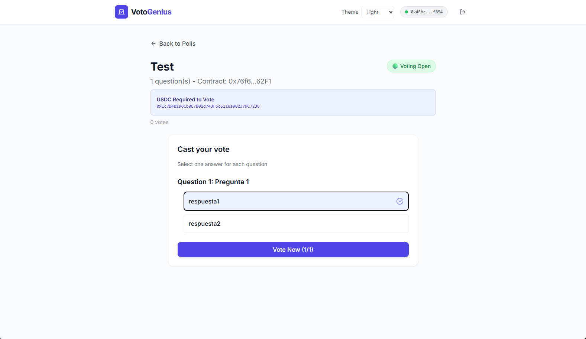
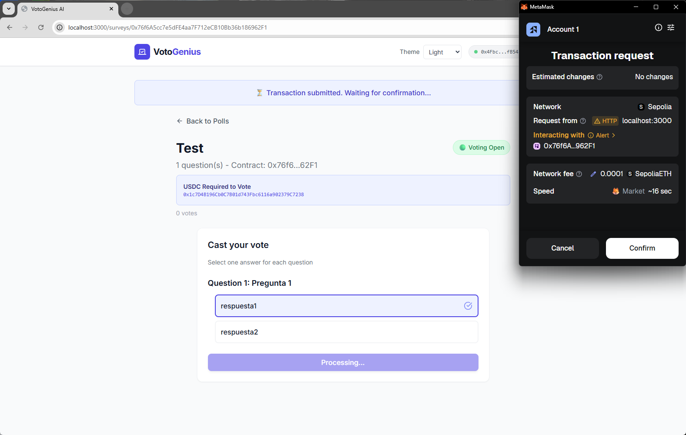
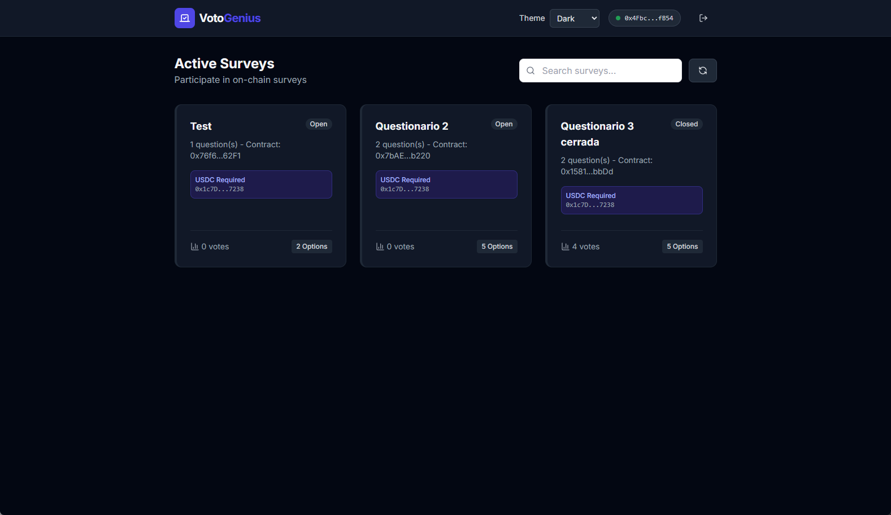
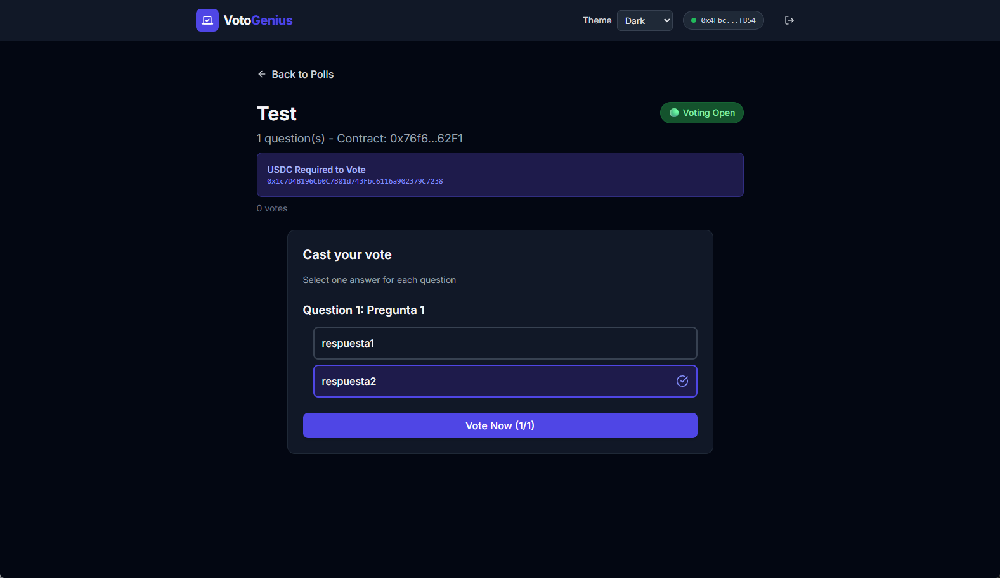

# VotoGenius AI – Smart‑Contract Powered Poll Viewer & Voting

VotoGenius is a decentralized interface for viewing and voting on on‑chain polls deployed as individual smart contracts (Sepolia testnet). Each poll lives at a contract address; votes are recorded on‑chain via the contract's `vote` function (multi‑question support). The app provides: light/dark/system theme toggle, per‑contract skeleton loading, runtime environment variable injection (Docker entrypoint), and optional AI analysis of aggregated results (Gemini). It does **not** create or deploy new polls.

> Deploy URL: [https://n8n-smart-contract-surveys.pvqgay.easypanel.host](https://n8n-smart-contract-surveys.pvqgay.easypanel.host)

## Goals

1. Transparent on‑chain voting: every selection triggers a real smart contract transaction on Sepolia.
2. Clear UX for multi‑question polls and real‑time loading state per contract.
3. Optional AI summary of results for quick insight (Gemini based).
4. Accessible theming (Light/Dark/System) honoring OS preference and user override.

## Application Flow

| Step | Description | Screenshot |
|------|-------------|------------|
| Landing | Introduction & entry point |  |
| Wallet Connect | Connect via Reown/Wagmi |   |
| Poll List | Shows open polls first, skeletons while each contract loads |  |
| Poll Detail & Vote | Multi‑question selection and submit on‑chain |   |
| AI Analysis | Interprets results (if enabled) | *Pending screenshot* |

### Dark Mode

| View | Screenshot |
|------|-----------|
| List |  |
| Detail |  |
| Vote |  |

Theme preference is persisted in `localStorage` and synced with the system media query.

## Stack & Tools

- **Frontend:** React 19, TypeScript, Vite 6
- **Styling:** Tailwind (class‑based dark mode), custom UI components
- **Web3:** Wagmi + Viem (Sepolia), Reown Provider for connection management
- **Smart Contracts:** Pre‑existing poll contracts (addresses configured in `SURVEY_CONTRACTS`).  is being used for edit and deploy the smart contract.
- **AI:** Gemini for optional result analysis; GitHub Copilot assisted development
- **Infra:** Docker multi‑stage build + Nginx static serving; runtime env injection via `env.js`
- **Runtime Config:** `APP_` prefix (runtime), `VITE_` prefix (build‑time) unified through `env.ts`
- **Dev Tools:** VS Code, Git, Node.js 22.x, Docker Compose

## Environment Variables

| Name | Scope | Description |
|------|-------|-------------|
| `VITE_GEMINI_API_KEY` | Build (dev) | Gemini API key consumed by Vite during development |
| `APP_GEMINI_API_KEY` | Runtime (prod) | Injected by `docker-entrypoint.sh` into `window.__ENV__` |

See `ENV_VARIABLES.md` for full details.

## Local Development

**Prerequisites:** Node.js 22.x (see `.nvmrc`), optional Docker.

```bash
npm install
cp .env.example .env.local
# Edit VITE_GEMINI_API_KEY with your key
npm run dev
```

## Docker / Compose

```bash
docker build -t votogenius:latest .
docker run -p 3000:80 -e APP_GEMINI_API_KEY=YOUR_KEY votogenius:latest

# With docker-compose (uses .env.local and maps VITE_ → APP_)
docker-compose up --build
```

## Architecture Overview

1. Wallet connect via Reown/Wagmi.
2. Poll contracts queried individually; skeleton per contract until loaded.
3. Voting executes the contract `vote` function (multi‑question array mapping).
4. Results aggregated from on‑chain reads; optional AI summary via Gemini.
5. Theme system applies and persists user/system preference.
6. Deployment: Vite static build → Nginx; runtime env variables override build‑time.

## Security & Considerations

- Exposing the Gemini key client‑side is suitable only for test/demo; consider a backend proxy for production.
- Sepolia is a testnet; do not rely on it for production funds.
- Latency depends on transaction confirmation; can be extended with indexing services.

## Roadmap

- Add AI analysis screenshot.
- Backend proxy for Gemini key & rate limiting.
- Pagination / indexing of polls.
- Multi‑network support.

---

Feedback & ideas welcome—feel free to open issues or PRs!
